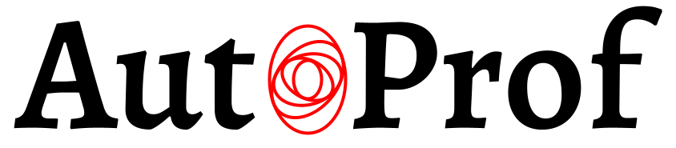

AutoProf is a pipeline for basic and advanced non-parametric galaxy image analysis.
Its design alows one to easily get started, but provides flexibility to explore new ideas and support advanced users.
It was written by [Connor Stone](https://connorjstone.com/) with contributions from
[Nikhil Arora](https://orcid.org/0000-0002-3929-9316),
[Stephane Courteau](https://www.physics.queensu.ca/facultysites/courteau/),
and [Jean-Charles Cuillandre](https://www.cfht.hawaii.edu/~jcc/).

# Introduction

This README explains basic use of the AutoProf code for extracting photometry
from galaxy images. The photometry is extracted via elliptical isophotes which
are fit with variable position angle and ellipticity, but a fixed center. The
isophotes are found by minimizing low order Fourier coefficients along
with regularization applied to minimize chaotic swings of isophote parameters.
The regularization penalizes isophotes for having PA and ellipticity values
very different from their neighbours.

# Installation

### Requirements

numpy, scipy, matplotlib, astropy, photutils, scikit-learn

If you have difficulty running AutoProf, it is possible that one of these dependencies is not in its latest (Python3) version and you should try updating.

### Basic Install

1. Download the package from: https://github.com/ConnorStoneAstro/AutoProf
    ```bash
    cd /where/you/want/AutoProf/to/live/
    git clone git@github.com:ConnorStoneAstro/AutoProf.git
    ```
    If you are having difficulty cloning the package, it is also possible to download a zip file of the package from the github page.
1. Set an environment variable and alias the AutoProf function. To make this permanent, include these lines in your .bashrc file (or equivalent for your OS). 
    ```bash
    export AUTOPROF='/path/to/AutoProf/'
    alias autoprof='/path/to/AutoProf/autoprof.py'
    ```
1. Run the test cases to see that all is well:
    ```bash
    cd /path/to/AutoProf/test/
    autoprof test_config.py
    autoprof test_forced_config.py Forced.log
    autoprof test_batch_config.py Batch.log
    autoprof test_tree_config.py Tree.log
    ```
    This will test a basic AutoProf run on a single galaxy, forced photometry of the galaxy on itself, and batch photometry for multiple images (which are actually the same in this case), and pipeline decision tree construction, respectively. You can also run all of these tests in one command by executing the *runtests.sh* script in bash.

### Issues

* Each analysis run should end with the words "Processing Complete!" if you don't get that, then the pipeline probably crashed at some point, check the log file (probably called *AutoProf.log*) for more information
* If you get *Permission Denied*, it is possible that the file is not listed as executable and you need to run:
    ```bash
    cd /path/to/AutoProf/
    chmod 755 autoprof.py
    ```
* If you have everything set up, but are getting strange errors such as *ImportError: No module named photutils* even when photutils is already installed it is possible that your python3 installation lives somewhere unusual. Try executing:
    ```bash
    which python3
    ```
    to see where your python3 installation lives. If the result is something other than */usr/bin/python3* then you need to make a small edit to the *autoprof.py* file. In the first line make the change from:
    ```python
    #!/bin/bash/python3
    ```
    to instead be:
    ```python
    #!/wherever/your/python3/is/installed
    ```

For other issues contact connor.stone@queensu.ca for help. The code has been tested on Linux and Mac machines.

# Using AutoProf

### Getting Started On A Single Image

The fastest way to run AutoProf for yourself will be for a single image.
The steps below describe how to get AutoProf to run on an image that you provide.
To run in batch mode for many images there isn't much to change, but that will be described later.

1. Copy the *test_config.py* script from the AutoProf test directory to the directory with your image. 
1. In the config file, edit the following lines:
    ```python
    ap_pixscale = # your image scale in arcsec/pix
    ap_image_file = # filename of your image
    ```
    and change any other options as they pertain to your image. If you aren't sure what to do, you can just remove an option from the config file. All that is truly needed to get started is *ap_process_mode*, *ap_pixscale*, and *ap_image_file*.
1. Run AutoProf on the configuration file:
    ```bash
    autoprof config.py
    ```
1. Check the .prof file for the surface brightness profile.
Check the .aux file for extra information, including checks on the success of the fit.
Check the .log file for messages about the progress of the fit, which are updated throughout the fitting procedure.
Also, look at the diagnostic plots to see if the fit appears to have worked.

Note that AutoProf has a list of arguments that it is expecting (see *List Of AutoProf Arguments* for a full list) and it only checks for those.
You can therefore make any variables or functions you need in the config file to construct your list of image files so long as they don't conflict with any of the expected AutoProf arguments.

### Other Processing Modes

There are 4 main processing modes for AutoProf: image, image list, forced image, forced image list.
The subsections below will outline how to use each mode.

#### Running AutoProf In Batch Mode

Running AutoProf in batch mode is relatively simple once you have learned how to work with a single image.
For an example batch processing config file, see the *test_batch_config.py* file in the AutoProf test directory.
You must modify the *ap_process_mode* command to:
```python
ap_process_mode = 'image list'
```
Then, some config parameters will need to be turned into lists.
The *ap_image_file* variable should now be a list of image files, instead of a single string.
Any other config parameter can be made into a list or left as a single value.
If a parameter is a list, it must be the same length as the *ap_image_file* list, if it is a single value then that value will be used for all instances.
For example, the *ap_pixscale* variable can be left as a float value and AutoProf will use that same value for all images.

Also unique to batch processing is the availability of parallel processing with the *ap_n_procs* variable.
Since image analysis is an "embarrassingly parallel problem" AutoProf can analyze many images simultaneously.
It is suggested that you set *ap_n_procs* equal to the number of processors you have, although you may need to experiment.
Especially if you don't have much ram, this may be the limiting factor.

#### Forced Photometry

Forced photometry allows one to take an isophotal solution from one image and apply it (kind of) blindly to another image.
An example forced photometry config file can be found in AutoProf test directory and is named *test_forced_config.py* which will only work once *test_config.py* has been run.
Forced photometry can be used for multi-band images from the same telescope, or between telescopes.
One may need to adjust for different pixel scales, or have to re-center between images, but the ultimate goal is to apply the same ellipticity and position angle profile to the galaxy in each band.
Running forced photometry is very similar to the other processing modes with one extra required parameter (the pre-fit .prof file).

1. Copy the *test_forced_config.py* script to the directory with your image. 
1. In the config file, edit the following lines:
    ```python
    ap_pixscale = # your image scale in arcsec/pix
    ap_image_file = # filename of your image
    ap_forcing_profile = # filename for the .prof output
    ```
1. Run AutoProf on the configuration file:
    ```bash
    autoprof forced_config.py
    ```
1. Check the .prof file for the surface brightness profile.
Check the .aux file for extra information, including checks on the success of the fit.
Check the .log file for messages about the progress of the fit, which are updated throughout the fitting procedure.
Also, look at the diagnostic plots to see if the fit appears to have aligned properly with the new image.

#### Batch Forced Photometry

You may be able to guess at this point.
To run forced photometry in batch mode, start with a single image forced photometry config file and convert single values into lists wherever necessary.

### List Of AutoProf Arguments

This is a list of all arguments that AutoProf will check for and a quick description of what they do.
In your config file, do not use any of these names unless you intend for AutoProf to interpret those values in it's image processing pipeline.

#### Required Parameters
- ap_pixscale: pixel scale in arcsec/pixel (float)
- ap_image_file: path to fits file with image data (string)
- ap_process_mode: analysis mode for AutoProf to run in (string)
- ap_forcing_profile: (required for forced photometry) file path to .prof file providing forced photometry PA and ellip values to apply to *ap_image_file* (string)

#### High Level Parameters
- ap_saveto: path to directory where final profile should be saved (string)
- ap_name: name to use for the galaxy, this will be the name used in output files and in the log file (string)
- ap_n_procs: number of processes to create when running in batch mode (int)
- ap_doplot: Generate diagnostic plots during processing (bool).
- ap_plotpath: Path to file where diagnostic plots should be written, see also *ap_doplot* (string)
- ap_plotdpi: sets dpi for plots (default 300). Can be used to reduce file size, or to increase detail in images (int)
- ap_hdulelement: index for hdul of fits file where image exists (int)
- ap_delimiter: Delimiter character used to separate values in output profile. Will default to a comma (",") if not given (string)
- ap_new_pipeline_methods: Allows user to set methods for the AutoProf pipeline analysis. See *Modifying Pipeline Methods* for more information (dict)
- ap_new_pipeline_steps: Allows user to change the AutoProf analysis pipeline by adding, removing, or re-ordering steps. See *Modifying Pipeline Steps* for more information (list)
- ap_zeropoint: Photometric zero point, AB magnitude is assumed if none given, corresponding to a zero point of 22.5 (float)
- ap_nologo: tells AutoProf not to put it's logo on plots. Please only use this for figures that will be used in publications that don't allow logos (bool)

#### Background
- ap_set_background: User provided background value in flux (float)
- ap_set_background_noise: User provided background noise level in flux (float)
- ap_background_speedup: speedup factor for background calculation. Speedup is achieved by reducing the number of pixels used
  			 in calculating the background, only use this option for large images where all pixels are not needed
			 to get an accurate background estimate (int)

#### PSF
- ap_guess_psf: initialization value for the PSF calculation in pixels. If not given, AutoProf will start with a guess of 1/*ap_pixscale* (float)
- ap_set_psf: force AutoProf to use this PSF value (in pixels) instead of calculating its own. (float)

#### Center
- ap_guess_center: user provided starting point for center fitting. Center should be formatted as:
		   {'x':float, 'y': float}, where the floats are the center coordinates in pixels. (dict)
- ap_set_center: user provided center for isophote fitting. Center should be formatted as:
		   {'x':float, 'y': float}, where the floats are the center coordinates in pixels. (dict)

#### Masking
- ap_badpixel_high: flux value that corresponds to a saturated pixel or bad pixel flag, all values above *ap_badpixel_high* will be masked
  		    if using the *Bad_Pixel_Mask* pipeline method. (float)
- ap_badpixel_low: flux value that corresponds to a bad pixel flag, all values below *ap_badpixel_low* will be masked
  		    if using the *Bad_Pixel_Mask* pipeline method. (float)
- ap_badpixel_exact: flux value that corresponds to a precise bad pixel flag, all values equal to *ap_badpixel_exact* will be masked
  		    if using the *Bad_Pixel_Mask* pipeline method. (float)
- ap_mask_file: path to fits file which is a mask for the image. Must have the same dimensions as the main image (string)
- ap_savemask: indicates if the star mask should be saved after fitting (bool)

#### Isophote Fitting
- ap_scale: growth scale when fitting isophotes, not the same as *ap_sample---scale* (float)
- ap_fit_limit: noise level out to which to extend the fit in units of pixel background noise level (float)
- ap_regularize_scale: scale factor to apply to regularization coupling factor between isophotes.
  		       Default of 1, larger values make smoother fits, smaller values give more chaotic fits. (float)

#### Isophote Sampling
- ap_samplegeometricscale: growth scale for isophotes when sampling for the final output profile.
                           Used when sampling geometrically (float)
- ap_samplelinearscale: growth scale (in pixels) for isophotes when sampling for the final output
                      	profile. Used when sampling linearly (float)
- ap_samplestyle: indicate if isophote sampling radii should grow linearly or geometrically. Can
                  also do geometric sampling at the center and linear sampling once geometric step
		  size equals linear (string, ['linear', 'geometric', 'geometric-linear'])
- ap_sampleinitR: Starting radius (in pixels) for isophote sampling from the image. Note that
   		  a starting radius of zero is not advised. (float)
- ap_sampleendR: End radius (in pixels) for isophote sampling from the image (float)
- ap_isoband_start: The radius (in pixels) at which to begin sampling a band of pixels to compute SB instead of sampling a line of pixels near the isophote (float)
- ap_isoband_width: The relative size of the isophote bands to sample. flux values will be sampled at +- *ap_isoband_width**R for each radius. default value is 0.025 (float)
- ap_truncate_evaluation: Stop evaluating new isophotes once two negative flux isophotes have been recorded, presumed to have reached the end of the profile (bool)
- ap_iso_interpolate_start: Use a bi-cubic spline interpolation for isophotes with semi-major axis less than this number times the PSF (float)
- ap_isoaverage_method: Select the method used to compute the averafge flux along an isophote. Choose from 'mean', 'median', and 'mode' where median is the default.
  			In general, median is fast and robust to a few outliers. Mode is slow but robust to more outliers. Mean is fast and accurate in low S/N regimes
			where fluxes take on near integer values, but not robust to outliers. The mean should be used along with a mask to remove spurious objects
			such as foreground stars or galaxies, and should always be used with caution. (string)
- ap_isoclip: Perform sigma clipping along extracted isophotes. Removes flux samples from an isophote that deviate significantly from the median. Several iterations
  	      of sigma clipping are performed until convergence or *ap_isoclip_iterations* iterations are reached. Sigma clipping is a useful substitute for masking
	      objects, though careful masking is better. Also an aggressive sigma clip may bias results. (bool)
- ap_isoclip_iterations: Maximum number of sigma clipping iterations to perform. The default is infinity, so the sigma clipping procedure repeats until convergence (int)
- ap_isoclip_nsigma: Number of sigma above median to apply clipping. All values above (median + *ap_isoclip_iterations* x sigma) are removed from the isophote (float) 

#### Radial Profiles
- ap_radialprofiles_nwedges: number of radial wedges to sample. Recommended choosing a power of 2 (int)
- ap_radialprofiles_width: User set width of radial sampling in degrees. Default value is 15 degrees (float)
- ap_radialprofiles_pa: user set position angle at which to measure radial wedges relative to the global position angle, in degrees (float)
- ap_radialprofiles_expwidth: tell AutoProf to use exponentially increasing widths for radial samples. In this case *ap_radialprofiles_width* corresponds to the final width of the radial sampling (bool)
- ap_radialprofiles_variable_pa: tell AutoProf to rotate radial sampling wedges with the position angle profile of the galaxy (bool)

#### Axial Profiles
- ap_axialprofiles_pa: user set position angle at which to align the axial profiles relative to the global position angle, in degrees. A common choice would
  		       be "90" which would then sample along the semi-major axis instead of the semi-minor axis. (float)

#### Slice Profile
- ap_slice_anchor: Coordinates for the starting point of the slice as a dictionary formatted "{'x': x-coord, 'y': y-coord}" in pixel units (dict)
- ap_slice_pa: Position angle of the slice in degrees, counter-clockwise relative to the x-axis (float)
- ap_slice_length: Length of the slice from anchor point in pixel units (float) 
- ap_slice_width: Width of the slice in pixel units (float)
- ap_slice_step: Distance between samples for the profile along the slice (float)

#### Ellipse Model
- ap_ellipsemodel_resolution: scale factor for the ellipse model resolution. Above 1 increases the precision of the ellipse model (and computation time), between 0 and 1 decreases
  			      the resolution (and computation time). Note that the ellipse model resolution is defined logarithmically, so the center will always be more resolved (float)

There is one argument that AutoProf can take in the command line, which is the name of the log file.
The log file stores information about everything that AutoProf is doing, this is useful for diagnostic purposes.
By default, AutoProf will name the log file *AutoProf.log*, if you wish to make it a different filename then add the filename when running AutoProf:
```bash
autoprof config.py newlogfilename.log
```

# How Does AutoProf Work?

At it's core AutoProf is a simple pipeline object that loads in an image, blindly runs a list of functions, and saves the resulting information.
It is equipped with a powerful default set of functions which can fit an isophotal solution to most galaxies, even with relatively complex features and low S/N.
Below is a high level description for the default pipeline methods, in case something goes wrong this may help you troubleshoot the issue.
This section will also help you write your own methods to integrate into AutoProf if you wish to handle a specific use case.

### Background

**pipeline label: background**

The default background calculation is done by searching for the "mode" of the pixel flux values.
First, the method extracts the border of the image, taking all pixels that are within 1/5th the image width of the edge.
Then it constructs a density profile in flux space and finds the peak.
This peak is used as the background level, a few rounds of sigma clipping are applied to remove bright signals before taking the background noise level (measured as an interquartile range).

Output format:
```python
{'background': , # flux value representing the background level (float)
'background noise': ,# measure of scatter around the background level (float)
'background uncertainty': ,# optional, uncertainty on background level (float)
'auxfile background': # optional, message for aux file to record background level (string)
}
```

### PSF

**pipeline label: psf**

Using an edge finding convolution filter, identifies candidate star pixels. Randomly iterates through the pixels and
searches for a local maximum. An FFT is used to identify non-circular star candidate (artifacts or galaxies) which may have
been picked up by the edge finder. Circular apertures are placed around the star until half the central flux value is reached,
This is recorded as the FWHM for that star. A collection of 50 stars are identified and the most circular (by FFT coefficients)
half are kept, a median is taken as the image PSF.


Output format:
```python
{'psf fwhm': ,# estimate of the fwhm of the PSF (float)
'auxfile psf': # optional, message for aux file to record psf estimate (string)
}
```

### Centering

**pipeline label: center**

Depending on the specified parameters, this function will start at the center of the image or at a user specified center.
From the starting point, the function will create 10 circular isophotes out to 10 times the PSF size and sample flux values around each isophote.
An FFT is taken for the flux values around each circular isophote and the phase of the first FFT coefficient is used to determine a direction on the image of increasing brightness.
Taking the average direction, flux values are sampled from the current center out to 10 times the PSF.
A parabola is fit to the flux values and the center is then updated to the maximum of the parabola.
This is repeated until the update steps become negligible.
At this point, a Nelder-Mead simplex optimizer is used for fine tuning to find a minimum in FFT first coefficient magnitude.

Output format:
```python
{'center': {'x': , # x coordinate of the center (pix)
	    'y': }, # y coordinate of the center (pix)
'auxfile center': # optional, message for aux file to record galaxy center (string)
}
```

### Global Isophote Fitting

**pipeline label: isophoteinit**

A global position angle and ellipticity are fit in a two step process.
First, a series of circular isophotes are geometrically sampled until they approach the background level of the image.
An FFT is taken for the flux values around each isophote and the phase of the second coefficient is used to determine a direction.
The average direction for the outer isophotes is taken as the position angle of the galaxy.
Second, with fixed position angle the ellipticity is optimized to minimize the amplitude of the second FFT coefficient relative to the median flux in an isophote.

To compute the error on position angle we use the standard deviation of the outer values from step one.
For ellipticity the error is computed by optimizing the ellipticity for multiple isophotes within 1 PSF length of each other.

Output format:
```python
{'init ellip': , # Ellipticity of the global fit (float)
 'init pa': ,# Position angle of the global fit (float)
 'auxfile initialize': # optional, message for aux file to record the global ellipticity and postition angle (string)
}
```

### Isophotal Fitting

**pipeline label: isophotefit**

A series of isophotes are constructed which grow geometrically until they begin to reach the background level.
Then the algorithm iteratively updates the position angle and ellipticity of each isophote individually for many rounds.
Each round updates every isophote in a random order.
Each round cycles between three options: optimizing position angle, ellipticity, or both.
To optimize the parameters, 5 values (pa, ellip, or both) are randomly sampled and the "loss" is computed.
The loss is a combination of the relative amplitude of the second FFT coefficient (compared to the median flux), and a regularization term.
The regularization term penalizes adjacent isophotes for having different position angle or ellipticity (using the l1 norm).
Thus, all the isophotes are coupled and tend to fit smoothly varying isophotes.
When the optimization has completed three rounds without any isophotes updating, the profile is assumed to have converged.

An uncertainty for each ellipticity and position angle value is determined by taking the RMS between the fitted values and a smoothed polynomial fit values for 4 points.
This is a very rough estimate of the uncertainty, but works sufficiently well in the outskirts.

Output format:
```python
{'fit R': , # Semi-major axis for ellip and pa profile (list)
'fit ellip': , # Ellipticity values at each corresponding R value (list)
'fit ellip_err': , # Optional, uncertainty on ellipticity values (list)
'fit pa': , # Position angle values at each corresponding R value (list)
'fit pa_err': , # Optional, uncertainty on position angle values (list)
'auxfile fitlimit': # optional, message ofr aux file to record fitting limit semi-major axis (string)
}
```

### Isophotal Profile Extraction

**pipeline label: isophoteextract**

The user may specify a variety of sampling arguments for the photometry extraction.
For example, a start or end radius in pixels, or whether to sample geometrically or linearly in radius.
Geometric sampling is the default as it is faster.
Once the sampling profile of semi-major axis values has been chosen, the function interpolates (spline) the position angle and ellipticity profiles at the requested values.
For any sampling beyond the outer radius from the *Isophotal Fitting* step, a constant value is used.
Within 1 PSF, a circular isophote is used.

Output format:
```python
{'prof header': , # List of strings indicating the order to write the .prof file data (list)
'prof units': , # Dictionary with keys from header, values are strings that give the units for each variable (dict)
'prof data': , # Dictionary with keys from header, values are lists with the data (dict)
'prof format': # Dictionary with keys from header, values are format strings for precision of writing the data (dict)
}
```

### Checking Isophotal Solution

**pipeline label: checkfit**

A variety of checks are applied to ensure that the fit has converged to a reasonable solution.
If a fit passes all of these checks then it is typically an acceptable fit.
However if it fails one or more of the checks then the fit likely either failed or the galaxy has strong non-axisymmetric features (and the fit itself may be acceptable).

One check samples the fitted isophotes and looks for cases with high variability of flux values along the isophote.
This is done by comparing the interquartile range to the median flux, if the interquartile range is larger then that isophote is flagged.
If enough isophotes are flagged then the fit may have failed.

A second check operates similarly, checking the second and fourth FFT coefficient amplitudes relative to the median flux.
If many of the isophotes have large FFT coefficients, or if a few of the isophotes have very large FFT coefficients then the fit is flagged as potentially failed.

A third check is similar to the first, except that it compares the interquartile range from the fitted isophotes to those using just the global position angle and ellipticity values.

Finally, the fourth check compares the total magnitude of the galaxy based on integrating the surface brightness profile against a simple sum of the flux within the isophotes (with a star mask applied).

Output format:
```python
{'checkfit': {'anything': , # True if the test was passed, False if the test failed (bool)
	      'you': , # True if the test was passed, False if the test failed (bool)
	      'want': , # True if the test was passed, False if the test failed (bool)
	      'to': , # True if the test was passed, False if the test failed (bool)
	      'put': }, # True if the test was passed, False if the test failed (bool)
'auxfile checkfit anything': ,# optional aux file message for pass/fail of test (string) 
'auxfile checkfit you': ,# optional aux file message for pass/fail of test (string) 
'auxfile checkfit want': ,# optional aux file message for pass/fail of test (string) 
'auxfile checkfit to': ,# optional aux file message for pass/fail of test (string) 
'auxfile checkfit put': # optional aux file message for pass/fail of test (string) 
}
```

### Writing the Results

**pipeline label: writeprof**

This step writes the results of the AutoProf pipeline analysis to a file.
There are two files written, a *.prof* file containing the surface brightness profile and acompanying measurements, and a *.aux* file containing global results, messages, and setting used for the pipeline.
The *.prof* file looks for specific keywords in the results dictionary: *prof header*, *prof units*, *prof data*, and *prof format*.
There are the results from the isophotal fitting step.
*prof header* gives the column names for the profile, *prof units* is a dictionary which gives the corresponding units for each column header key, *prof data* is a dictionary containing a list of values for each header key, and *prof format* is a dictionary which gives the python string format for values under each header key (for example '%.4f' gives a number to 4 decimal places).
The profile is written with comma (or a user specified delimiter) separation for each value, where each row corresponds to a given isophote at increasing semi-major axis values.

The *.aux* file has a less strict format than the *.prof* file.
The first line records the date and time that the file was written, the second line gives the name of the object as specified by the user or the filename.
The next lines are taken from the results dictionary, any result key with *auxfile* in the name is taken as a message for the *.aux* file and written (in alphabetical order by key) to the file.
See the pipeline step output formats for the messages that are included in the *.aux* file.
Finally, a record of the user specified options is included for reference.

Output format:
no results added from this step
```python
{}
```

# Advanced Usage

### Modifying Pipeline Methods

This is done with the *ap_new_pipeline_methods* argument, which is formatted as a dictionary with string keys and functions as values.
In this way you can add to or alter the methods used by AutoProf in it's pipeline.

Each of the methods in *How Does AutoProf Work?* has a pipeline label, this is how the code identifies the functions and their outputs.
Thus, one can create their own version of any method and modify the pipeline by assigning the function to that label.
For example, if you wrote a new center finding method, you could update the pipeline by including:
```python
ap_new_pipeline_methods = {'center': My_Center_Finding_Method}
```
in your config file.
You can also make up any other methods and add them to the pipeline functions list, assigning whatever key you like.
However, AutoProf will only look for methods that are in the *pipeline_steps* object, so see *Modifying Pipeline Steps* for how to add/remove/reorder steps in the pipeline.

Every function in the pipeline has the same template.
To add a new function, or replace an existing one, you must format it as:
```python
def My_New_Function(IMG, results, options):
    # Code here
    return IMG, {'results': of, 'the': calculations}
```
where *IMG* is the input image, *results* is a dictionary containing the output of all previous pipeline steps, and *options* is a dictionary with all user specified arguments from *List Of AutoProf Arguments* if they have non-default values.
The output of every method in the pipeline is an image and a dictionary with strings for keys.
The output image is assigned to replace the input image, so if you wish to alter the input image you can do so in a way that all future steps will see.
The dictionary output is used to update the *results* dictionary that is passed to all future methods, you can therefore add new elements to the dictionary or replace older ones. 
If you wish to replace a method, make sure to have the output follow this format.
So long as your output dictionary has the same keys/value format, it should be able to seamlessly replace a step in the pipeline.
If you wish to include more information, you can include as many other entries in the dictionary as you like, the default methods functions will ignore them.
See *How Does AutoProf Work?* for the expected outputs from each function.

### Modifying Pipeline Steps

This is done with the *ap_new_pipeline_steps* argument, which is formatted as a list of strings which tells AutoProf what order to run it's pipeline methods.
In this way you can alter the order of operations used by AutoProf in it's pipeline.

Each function must be run in a specific order as they often rely on the output from another step.
The basic pipeline step order is:
```python
['background', 'psf', 'center', 'isophoteinit', 'isophotefit', 'isophoteextract', 'checkfit', 'writeprof']
```
For forced photometry the default pipeline step order is:
```python
['background', 'psf', 'center forced', 'isophoteinit', 'isophotefit forced', 'isophoteextract forced', 'writeprof']
```
If you would like to change this behaviour, just provide a *ap_new_pipeline_steps* list.
For example if you wished to use forced photometry but you want to re-fit the center you can change *center forced* back to *center* with:
```python
ap_new_pipeline_steps = ['background', 'psf', 'center', 'isophoteinit', 'isophotefit forced', 'isophoteextract forced', 'writeprof']
```
in your config file.

You can create your own order, or add in new functions by supplying a new list.
For example, if you had your own method to run after the centering function you could do so by including:
```python
ap_new_pipeline_methods = {'mymethod': My_New_Method}
ap_new_pipeline_steps = ['background', 'psf', 'center', 'mymethod', 'isophoteinit', 'isophotefit', 'isophoteextract', 'checkfit', 'writeprof']
```
in your config file.
Note that for *ap_new_pipeline_methods* you need only include the new function, while for *ap_new_pipeline_steps* you must write out the full pipeline steps.
If you wish to skip a step, it is sometimes better to write your own "null" version of the function (and change *ap_new_pipeline_methods*) that just returns do-nothing values for it's dictionary as the other functions may still look for the output and could crash.

### Going Deeper, Decision Tree Pipelines

AutoProf at its core is a pipeline building code, as such it has a more advanced feature for constructing complex pipelines: decision trees.
In a decision tree pipeline, one can essentially construct a flow chart of decisions and corresponding methods to run and options to use.
The beginning of the tree is always *'head'* and AutoProf will continue to read those steps until it reaches a step containing the word *branch* (any other text can be included in the step name so you can write many different branches).
At a branch step, AutoProf will provide the usual inputs, but the output should be a string or *None* and a dictionary of new options (if any).
If *None* is returned then AutoProf carries on along the same branch it is already on.
If a string is returned, then that is taken as the key from which to check for the next step in the pipeline steps object.
An empty dictionary can be used to change no options.
When switching branches, AutoProf will start at the beginning of the new branch.
Note, the new branch can even be the branch you started on so watch out for infinite loops!

For example, in a large sample, one may wish to process edge-on galaxies differently than the others, but it may not be clear which galaxies fit the edge-on criteria until the photometry is done.
In this example, one could have AutoProf perform photometry up to the point of the *isophoteinit* step, then the rest of the functions could be chosen based on the ellipticity of the initialized ellipse.
To make this work one could add:
```python
def My_Edgeon_Fit_Method(IMG, results, options):
    N = 100
    return IMG, {'fit ellip': np.array([results['init ellip']]*N), 'fit pa': np.array([results['init pa']]*N),
                 'fit ellip_err': np.array([0.05]*N), 'fit pa_err': np.array([5*np.pi/180]*N),
                 'fit R': np.logspace(0,np.log10(results['init R']*2),N)}
ap_new_pipeline_methods = {'branch edgeon': lambda IMG,results,options: ('edgeon' if results['init ellip'] > 0.8 else 'standard', {}),
			   'edgeonfit': My_Edgeon_Fit_Method}
ap_new_pipeline_steps = {'head': ['background', 'psf', 'center', 'isophoteinit', 'branch edgeon'],
		         'standard': ['isophotefit', 'isophoteextract', 'checkfit', 'writeprof'],
		         'edgeon': ['edgeonfit', 'isophoteextract', 'writeprof', 'axialprofiles', 'radialprofiles']}
```
in the config file. This config file would apply a standard pipeline for face-on or moderately inclined galaxies, but a special pipeline for edge-on galaxies which includes a user defined fitting function *My_Edgeon_Fit_Method*, axial profiles, and radial profiles. This example is included in the test folder as the *test_tree_config.py* example config file.

# Methods that come with AutoProf

As well as the default pipeline, AutoProf has a number of pre-built methods for different use cases and extending one's analysis beyond a direct isophote fit.
Here we outline a basic description of those methods and some of their use cases (though you may find clever new uses!).
Some are meant as drop-in replacements for methods in the default pipeline, and others are meant as entirely new methods.

### Background - Dilated Sources

**pipeline label: 'background dilatedsources'**

Using the photutils *make_source_mask* function, a mask is constructed for bright sources in the image.
A "dilation" is then applied to expand the masked area around each source.
The background is then taken as the median of the unmasked pixels.
The noise is half the 16-84 quartile range of unmasked pixels.

### Background - Basic

**pipeline label: 'background basic'**

All pixels in the outer boarder of the image (outer 1/4th of the image) are taken, the mean value is the background, standard deviation is the noise.

### Background - Unsharp masking

**pipeline label: 'background unsharp'**

A two-dimensional FFT is taken on the image, the background level is computed across the image using a low pass filter of the FFT coefficients.

### PSF - IRAF

**pipeline label: 'psf IRAF'**

The photutils IRAF star finder wrapper is used to identify stars in the image, the psf is taken as the average fwhm fitted by IRAF.

### Center - Mean

**pipeline label: 'center mean'**

Similar to the standard center finding method, except flux values along circular apertures are evaluated using the mean (instead of the median) which is more accurate in the low S/N limit that pixel values are integers.

### Center - 2D Gaussian

**pipeline label: 'center 2DGaussian'**

Wrapper for photutils center finding method which fits a 2D Gaussian to the image in order to find the center of a galaxy.

### Center - 1D Gaussian

**pipeline label: 'center 1DGaussian'**

Wrapper for photutils center finding method which fits a series of 1D Gaussians to slices of the image to identify the galaxy center.

### Center - Of Mass

**pipeline label: 'center OfMass'**

Wrapper for photutils method which finds the flux centroid of an image to determine the center.

### Isophote Initialize - Mean

**pipeline label: 'isophoteinit mean'**

Similar to the standard isophote initialization method, except flux values along isophotes are evaluated using the mean (instead of the median) which is more accurate in the low S/N limit that pixel values are integers.

### Plot Clean Image

**pipeline label: 'plot image'**

Simply plots an image of the galaxy using hybrid histogram equalization and log scale, without any other features or tests drawn on top. This can be useful for inspecting the image for spurious features without any ellipses, lines, or other objects drawn overtop. The size of the image will be based on when the step is called in the pipeline, if it is called early in the pipeline then a larger and less centered image will be used, calling later in the pipeline will use later pieces of information to choose the image size and centering.

### Isophote Fitting - Mean

**pipeline label: 'isophotefit mean'**

Similar to the standard isophote fitting method, except flux values along isophotes are evaluated using the mean (instead of the median) which is more accurate in the low S/N limit that pixel values are integers.

### Isophote Fitting - photutils

**pipeline label: 'isophotefit photutils'**

Wrapper for the photutils isophote fitting method which is based on Jedzejewski 1987.

### Masking - Bad Pixels

**pipeline label: 'mask badpixels'**

Identifies pixels that meet "bad pixel" criteria set by user options and constructs a mask.

### Star Masking - IRAF

**pipeline label: 'starmask'**

Using the photutils wrapper of IRAF, identifies stars in the image and masks them.

### Masking - Segmentation Map

**pipeline label: 'mask segmentation map'**

Reads in a user provided segmentation map and converts it into a mask. If a galaxy center has been found it will ignore the segmentation ID where the center lays.

### Ellipse Model - Fixed

**pipeline label: 'ellipsemodel'**

Constructs a 2D model image of the galaxy based on the extracted surface brightness profile and the global ellipticity and position angle values.

### Ellipse Model - General

**pipeline label: 'ellipsemodel general'**

Constructs 2D model image of the galaxy based on the extracted surface brightness, ellipticity, and position angle profile.

### Radial Profiles

**pipeline label: 'radialprofiles'**

Samples surface brightness values radially from the center of the galaxy. The radial samples are placed on the semi-minor/major axes by default, though more wedges can be requested and their angle can be specified by the user.

### Axial Profiles

**pipeline label: 'axialprofiles'**

Samples surface brightness values along lines parallel to the semi-minor axis.

### Slice Profile

**pipeline label: 'sliceprofile'**

Samples surface brightness values along a user specified line (slice) on the image.